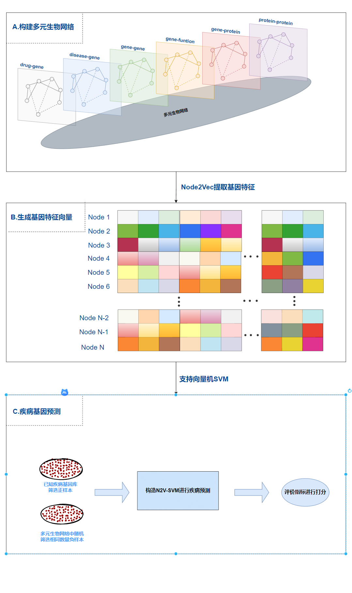

# N2V-SVM
基于图表示学习的疾病预测

## Frame :




## Usage :
## 1.预处理
```bash
python3 ./main.py 
```
## 2.node2vec提取基因特征
```bash
node2vec-master-change/main.py
```
## 3.融合生成多元生物网络
```bash
python3 ./all.py 
```
## 4.筛选正负样本
```bash
python3 ./processData.py 
```
## 5.构造N2V-SVM预测得分
```bash
python3 ./svm.py 
```
